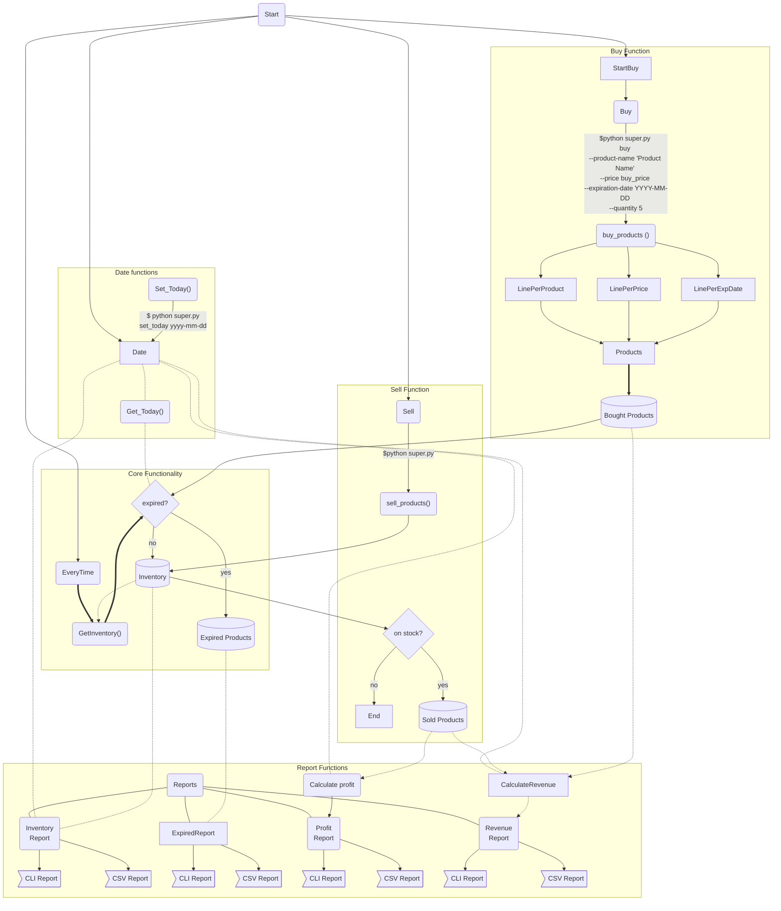

```mermaid
graph TB;
    
    Begin("Start")
    Begin --> StartBuy
    Begin ---> Date
    Begin --> BasicStart
    Begin --> StartSell

   
    

    subgraph Date functions
        Date -.- GetToday
        SetToday("Set_Today()") -->|"$ python super.py \nset_today yyyy-mm-dd"| Date
    end

    subgraph Core Functionality
        direction TB
       
        BasicStart ==> GetInventory

        GetInventory("GetInventory()")
        
        Inventory -.-> GetInventory

        GetInventory ==> Expired

        GetToday("Get_Today()") <-.- Expired

        Expired --->|yes| ExpiredProducts
        Expired -->|no| Inventory
        
        Expired{"expired?"}
        Inventory[("Inventory")]
        ExpiredProducts[("Expired Products")]
        BasicStart(EveryTime)
    end

    subgraph Sell Function
        StartSell("Sell")

        StartSell -->|"$python super.py \n"| B

        B("sell_products()")
        B --> Inventory

        Inventory --> OnStock

        OnStock{"on stock?"}
        OnStock -->|no| End
        OnStock -->|yes| Sold
        Sold[("Sold Products")]
    end
    subgraph Buy Function
        StartBuy --> BuyProducts
        BuyProducts -->|"$python super.py \nbuy \n--product-name 'Product Name' \n--price buy_price \n--expiration-date YYYY-MM-DD \n--quantity 5"| A

        A --> LinePerProduct
        A --> LinePerPrice
        A --> LinePerExpDate
        
        LinePerProduct --> Products
        LinePerPrice --> Products
        LinePerExpDate --> Products

        Products ==> BoughtProducts
        A("buy_products ()")
        BuyProducts("Buy")

        BoughtProducts[("Bought Products")]

        BoughtProducts --> Expired

    end

    subgraph Report Functions
        direction BT
        Reports(Reports)
        InventoryReport(Inventory\nReport)
        RevenueReport(Revenue\nReport)
        ProfitReport(Profit\nReport)

        Reports --- InventoryReport
        Reports --- ExpiredReport
        Reports --- RevenueReport
        Reports --- ProfitReport

        Date -.- InventoryReport
        Date -.- CalculateProfit
        Date -.- CalculateRevenue

        Inventory <-.- InventoryReport

        InventoryReport --> Inventory_CLIReport
        InventoryReport --> Inventory_CSVReport

        Inventory_CLIReport>CLI Report]
        Inventory_CSVReport>CSV Report]

        ExpiredProducts <-.- ExpiredReport

        ExpiredReport --> Expired_CLIReport
        ExpiredReport --> Expired_CSVReport

        Expired_CLIReport>CLI Report]
        Expired_CSVReport>CSV Report]

        Sold -.-> CalculateProfit

        CalculateProfit --> ProfitReport

        CalculateProfit("Calculate profit")

        ProfitReport --> Profit_CLIReport
        ProfitReport --> Profit_CSVReport

        Profit_CLIReport>CLI Report]
        Profit_CSVReport>CSV Report]

        Sold -.-> CalculateRevenue
        BoughtProducts -.-> CalculateRevenue

        CalculateRevenue -.-> RevenueReport

        RevenueReport --> Revenue_CLIReport
        RevenueReport --> Revenue_CSVReport

        Revenue_CLIReport>CLI Report]
        Revenue_CSVReport>CSV Report]


      
    end


    
    
    

```

