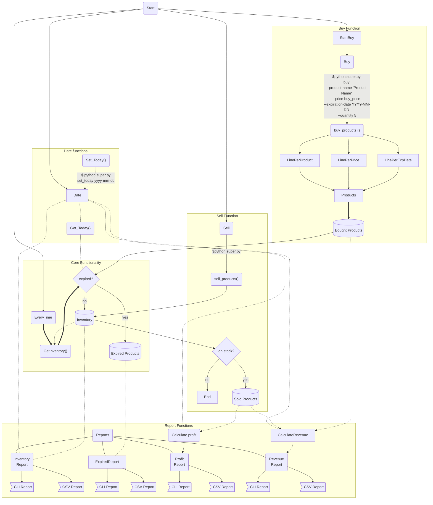

# report

### Gebruik van de CSV-module: 

De code maakt gebruik van de CSV-module om gegevens te lezen en schrijven naar CSV-bestanden. Dit is een goede keuze omdat CSV-bestanden een veelvoorkomend formaat zijn voor het opslaan van tabulaire gegevens, en de CSV-module een eenvoudige en efficiënte manier biedt om gegevens naar deze bestanden te lezen en schrijven. De code gebruikt ook de csv.writerows() methode om meerdere rijen tegelijk naar een CSV-bestand te schrijven, wat efficiënter is dan elke rij afzonderlijk schrijven.

### Gebruik van de datetime-module: 

De code maakt gebruik van de datetime-module om met datums en tijden te werken. Dit is een goede keuze omdat de datetime-module een uitgebreide reeks functies biedt voor het werken met datums en tijden, waaronder het analyseren en formatteren van datums, rekenkundige bewerkingen met datums en het omzetten tussen tijdzones. De code gebruikt ook de strftime() methode om datums als strings te formatteren, wat een veelvoorkomende en handige manier is om met datums in Python te werken.

### Gebruik van de tabulate-module: 

De code maakt gebruik van de tabulate-module om opgemaakte tabellen te genereren op basis van gegevens. Dit is een goede keuze omdat opgemaakte gegevens gemakkelijker te lezen en te begrijpen zijn dan ruwe gegevens, vooral bij het werken met grote datasets. De code gebruikt ook het tablefmt argument om het formaat van de tabel op te geven, wat aanpassing van het uiterlijk van de tabel mogelijk maakt. Bovendien exporteert de code de gegenereerde tabel naar een CSV-bestand met behulp van de export_csv() functie, wat een handige functie is voor het delen van gegevens met anderen.

Schematische weergave van de code:

